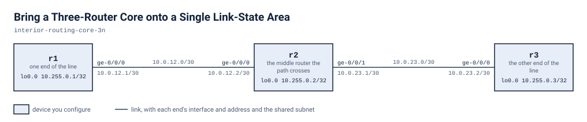

# Bring a Three-Router Core onto a Single Link-State Area

Three routers in a line, r1 - r2 - r3, start with addressed links and loopbacks but no routing protocol. You bring them into a single OSPF area 0.0.0.0, first so the far link subnets are learned, then so every loopback is learned and the two ends ping each other across r2.

## Scenario

You run a small core made of three routers in a line: r1, r2 and r3. r1 connects to r2, and r2 connects to r3. The links are addressed and up, and every router has a loopback. What is missing is a routing protocol. Today each router reaches only the neighbours it shares a link with, so r1 and r3 cannot see each other at all. The team does not want static routes. They want the routers to learn each other's networks from a link-state protocol, and they want proof that the two ends of the line can reach each other's loopbacks through r2. You will do it in two stages: first get the routers talking to each other, then bring the loopbacks in.

## Before you start

Start the lab with `labpack start` from this directory and wait until it says the lab is ready. Each node boots into the start state from its own file under `configs/`, so there is nothing to apply by hand before you begin. `lab.yaml` records how much memory and how many cores the lab needs and where the node images come from; `labpack doctor` checks a machine against it.

If you run the lab with plain containerlab instead and your own image is tagged differently, set `VJUNOS_ROUTER_IMAGE` before you deploy; the topology takes the tag from the environment and falls back to the default it names.

## Working with this lab

<!-- labpack:generated working-with-this-lab -->

This lab comes with a launcher that runs it for you. Every command below is run from this directory, and none of them asks you to type a sign-in.

| To do this | Run this |
| --- | --- |
| Set up the machine the labs run on, once | `labpack setup` |
| Check that machine against what this lab needs | `labpack doctor` |
| See which node images this lab needs | `labpack images` |
| Start the lab and wait until it is ready | `labpack start` |
| Open a session on one of its devices | `labpack connect r1` |
| See whether a stage's outcomes have been reached | `labpack check s1` |
| Ask for the author's hint | `labpack hint s1` |
| Put every device back to the starting state | `labpack reset` |
| Jump to the start of a stage | `labpack goto s1` |
| See a stage's answer | `labpack solution s1` |
| Shut the lab down and prove nothing is left | `labpack down` |

The first time, on a machine that has never run one of these labs, work through `labpack setup`: it asks where the labs should run, sets up the way in, checks the machine against what this lab needs, and walks through any node image that is missing. After that it is remembered and no later command needs to be told again.

The nodes of this lab are `r1`, `r2` and `r3`. Some of them may be fixtures rather than devices you work on; the drawing below says which.

This lab's stages are `s1` and `s2`. Put the one you are working on after `labpack check`, `labpack hint`, `labpack goto` and `labpack solution`.

`labpack goto` and `labpack solution` need the full download. The student download carries no answers, and those two commands say so rather than guess.

You can also run this lab with nothing but the container runtime. `topology.clab.yml` is a plain topology file, every node boots its own starting state from a file under `configs/`, and each file under `checks/` states one outcome as data: which device to ask, what to ask it, and what the answer has to be. So you can read a check and look at the same outcome yourself.

<!-- /labpack:generated working-with-this-lab -->

## Topology

<!-- labpack:generated topology -->

| Node | Its part in this network |
| --- | --- |
| r1 | one end of the line |
| r2 | the middle router the path crosses |
| r3 | the other end of the line |

| Node | Interface | Faces | Address |
| --- | --- | --- | --- |
| r1 | ge-0/0/0 | r2 | 10.0.12.1/30 |
| r1 | lo0.0 | no link | 10.255.0.1/32 |
| r2 | ge-0/0/0 | r1 | 10.0.12.2/30 |
| r2 | ge-0/0/1 | r3 | 10.0.23.1/30 |
| r2 | lo0.0 | no link | 10.255.0.2/32 |
| r3 | ge-0/0/0 | r2 | 10.0.23.2/30 |
| r3 | lo0.0 | no link | 10.255.0.3/32 |

The drawing and the tables above are the whole of the wiring: every node, every link, the interface each link is on at both of its ends, and the address each of them starts with. These are the interface names to use, and nothing in this lab needs any other interface. An interface with no address yet is shown without one.

<!-- /labpack:generated topology -->

## Addressing

| Router | Interface | Address |
| --- | --- | --- |
| r1 | ge-0/0/0 (to r2) | 10.0.12.1/30 |
| r1 | lo0.0 | 10.255.0.1/32 |
| r2 | ge-0/0/0 (to r1) | 10.0.12.2/30 |
| r2 | ge-0/0/1 (to r3) | 10.0.23.1/30 |
| r2 | lo0.0 | 10.255.0.2/32 |
| r3 | ge-0/0/0 (to r2) | 10.0.23.2/30 |
| r3 | lo0.0 | 10.255.0.3/32 |

## Design values

| Item | Value |
| --- | --- |
| OSPF area | 0.0.0.0 on all three routers |
| Link interfaces in the area | r1 ge-0/0/0; r2 ge-0/0/0 and ge-0/0/1; r3 ge-0/0/0 |
| Loopbacks advertised into the area | 10.255.0.1/32, 10.255.0.2/32, 10.255.0.3/32 |

## What is already built

Every link interface and every loopback is already addressed and up, and you should leave that alone. The addressing and design values tables show what is where. No routing protocol is configured on any router, and there are no static routes to carry the traffic. r1 can reach r2 on the r1-r2 link, and r3 can reach r2 on the r2-r3 link. Nothing goes further than one hop.

## Stage 1 — Bring up the routing area

Make r1, r2 and r3 exchange routing information over their point-to-point links, all in one OSPF area, 0.0.0.0. Only the link interfaces take part at this stage. Each end router has to learn the far link subnet from the protocol, not from a static entry. Do not disturb the link interfaces or their addresses.

**You're done when**

- r1 has a route to 10.0.23.0/30 whose protocol is OSPF, with r2 as the next hop.
- r3 has a route to 10.0.12.0/30 whose protocol is OSPF, with r2 as the next hop.
- The link interfaces on all three routers are still up.

Hint: Ask what each end router knew about the far link before, and what would have to reach it to change that. A neighbour only tells you about networks it has been told to announce, and it only becomes a neighbour if both sides agree on the area.

<!-- labpack:generated check-your-work-s1 -->

**Check your work.** `labpack check s1`. Stuck? `labpack hint s1` gives you the author's hint for whichever outcome is not met yet.

<!-- /labpack:generated check-your-work-s1 -->

## Stage 2 — Prove end-to-end reachability

Make every router's loopback part of the same routing area so that the loopbacks are learned from the protocol, and the two ends of the line can reach each other's loopback across r2. Keep the single area from stage 1 and do not add static routes.

**You're done when**

- r1 has OSPF routes to 10.255.0.2/32 and to 10.255.0.3/32.
- r3 has an OSPF route to 10.255.0.1/32.
- r1 can ping 10.255.0.3 and r3 can ping 10.255.0.1, with no packet loss.
- The link interfaces are still up.

Hint: A loopback has no neighbours, so nothing will announce it on its own. Think about what makes the protocol aware of an address that is not on a link, and check that all three routers did the same.

<!-- labpack:generated check-your-work-s2 -->

**Check your work.** `labpack check s2`. Stuck? `labpack hint s2` gives you the author's hint for whichever outcome is not met yet.

<!-- /labpack:generated check-your-work-s2 -->

## Checking your work

Each outcome of this exercise is written as a check under `checks/`. `checks/baseline.yaml` states what is true before you start and must stay true, and one file per stage states that stage's outcome. Every check names the device and the command it reads, so you can run them with the launcher for this format or read the file and check the outcome by hand.

## Tearing down

Take the lab down with `labpack down`, which proves nothing of it is left running. A lab left up holds the memory and the cores the next one needs.
