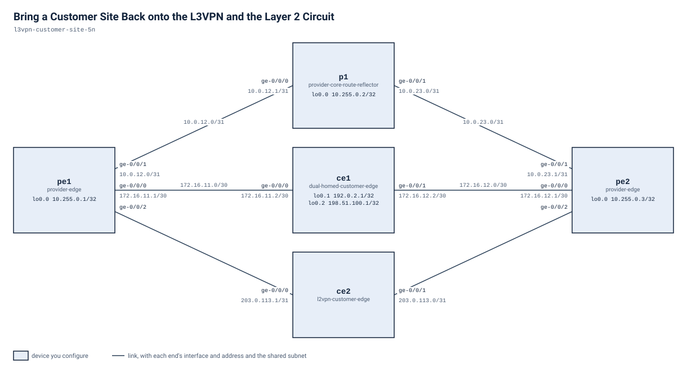

# Bring a Customer Site Back onto the L3VPN and the Layer 2 Circuit

Lab type: build. Level: Advanced. Two stages, both on `pe1`. Allow about 45 minutes once the
routers are up.

## Scenario

You have inherited a small service provider floor. The core is healthy: `p1` is an LDP/MPLS
transit router and the route reflector for VPN routes, and `pe2` is fully configured for both
customers it serves. `pe1` boots, reaches the core, and holds its provider-side sessions — but
every statement that made it a *customer-facing* router is gone.

Two customers hang off `pe1`:

- `ce1` is a dual-homed routed customer. Its site 1 link lands on `pe1` and its site 2 link lands
  on `pe2`. Both sites belong to the same customer VPN and exchange their site prefixes across the
  provider core.
- `ce2` is a layer 2 customer. It hands one Ethernet port to `pe1` and another to `pe2`, and
  expects the provider to carry that segment between them without routing it.

Neither customer works through `pe1` right now. Your job is to put `pe1` back, one service at a
time.

## Before you start

This lab wants a machine with about 28 GB of free memory and 20 cores: five routers, each of
which is a virtual machine holding roughly 5 GB and 4 cores for as long as the lab is up.
`labpack doctor` compares that with the machine you point it at and says `no` rather than
letting you find out the slow way.

Each router takes several minutes to boot and load its starting state, so expect the lab to
take a few minutes to come up. `labpack start` waits for all of it, then proves the lab really
started in the state this exercise expects — the baseline checks in `checks/baseline.yaml` are
that state written down, and they are the definition of "the lab is ready". Do not start work
until it says so.

The next section has every command, including the ones for getting into a router and for
checking your work. You are never asked to type an address or a sign-in.

The start state is in `configs/` twice, and both files say the same thing. `configs/<node>.cfg`
is what the topology hands each router at boot, in the hierarchical format `show configuration`
prints; leave those files alone. `configs/<node>.set` is the same start state written as `set`
statements, so you can read what each router starts with, and paste any part of it back, without
deploying anything.

## Working with this lab

<!-- labpack:generated working-with-this-lab -->

This lab comes with a launcher that runs it for you. Every command below is run from this directory, and none of them asks you to type a sign-in.

| To do this | Run this |
| --- | --- |
| Set up the machine the labs run on, once | `labpack setup` |
| Check that machine against what this lab needs | `labpack doctor` |
| See which node images this lab needs | `labpack images` |
| Start the lab and wait until it is ready | `labpack start` |
| Open a session on one of its devices | `labpack connect pe1` |
| See whether a stage's outcomes have been reached | `labpack check stage-1-customer-routing-instance` |
| Ask for the author's hint | `labpack hint stage-1-customer-routing-instance` |
| Put every device back to the starting state | `labpack reset` |
| Jump to the start of a stage | `labpack goto stage-1-customer-routing-instance` |
| See a stage's answer | `labpack solution stage-1-customer-routing-instance` |
| Shut the lab down and prove nothing is left | `labpack down` |

The first time, on a machine that has never run one of these labs, work through `labpack setup`: it asks where the labs should run, sets up the way in, checks the machine against what this lab needs, and walks through any node image that is missing. After that it is remembered and no later command needs to be told again.

The nodes of this lab are `pe1`, `pe2`, `p1`, `ce1` and `ce2`. Some of them may be fixtures rather than devices you work on; the drawing below says which.

This lab's stages are `stage-1-customer-routing-instance` and `stage-2-layer2-circuit`. Put the one you are working on after `labpack check`, `labpack hint`, `labpack goto` and `labpack solution`.

`labpack goto` and `labpack solution` need the full download. The student download carries no answers, and those two commands say so rather than guess.

You can also run this lab with nothing but the container runtime. `topology.clab.yml` is a plain topology file, every node boots its own starting state from a file under `configs/`, and each file under `checks/` states one outcome as data: which device to ask, what to ask it, and what the answer has to be. So you can read a check and look at the same outcome yourself.

<!-- /labpack:generated working-with-this-lab -->

## Topology

<!-- labpack:generated topology -->



| Node | Its part in this network |
| --- | --- |
| pe1 | provider-edge |
| pe2 | provider-edge |
| p1 | provider-core-route-reflector |
| ce1 | dual-homed-customer-edge |
| ce2 | l2vpn-customer-edge |

| Node | Interface | Faces | Address |
| --- | --- | --- | --- |
| pe1 | ge-0/0/0 | ce1 | 172.16.11.1/30 |
| pe1 | ge-0/0/1 | p1 | 10.0.12.0/31 |
| pe1 | ge-0/0/2 | ce2 | — |
| pe1 | lo0.0 | no link | 10.255.0.1/32 |
| pe2 | ge-0/0/0 | ce1 | 172.16.12.1/30 |
| pe2 | ge-0/0/1 | p1 | 10.0.23.1/31 |
| pe2 | ge-0/0/2 | ce2 | — |
| pe2 | lo0.0 | no link | 10.255.0.3/32 |
| p1 | ge-0/0/0 | pe1 | 10.0.12.1/31 |
| p1 | ge-0/0/1 | pe2 | 10.0.23.0/31 |
| p1 | lo0.0 | no link | 10.255.0.2/32 |
| ce1 | ge-0/0/0 | pe1 | 172.16.11.2/30 |
| ce1 | ge-0/0/1 | pe2 | 172.16.12.2/30 |
| ce1 | lo0.1 | no link | 192.0.2.1/32 |
| ce1 | lo0.2 | no link | 198.51.100.1/32 |
| ce2 | ge-0/0/0 | pe1 | 203.0.113.1/31 |
| ce2 | ge-0/0/1 | pe2 | 203.0.113.0/31 |

The drawing and the tables above are the whole of the wiring: every node, every link, the interface each link is on at both of its ends, and the address each of them starts with. These are the interface names to use, and nothing in this lab needs any other interface. An interface with no address yet is shown without one.

<!-- /labpack:generated topology -->

## Addressing

| Node | Interface | Faces | Address | Purpose |
| --- | --- | --- | --- | --- |
| pe1 | lo0.0 | — | 10.255.0.1/32 | Router ID and transport endpoint |
| pe1 | ge-0/0/0 | ce1 site 1 | 172.16.11.1/30 | Routed customer access |
| pe1 | ge-0/0/1 | p1 | 10.0.12.0/31 | Core link, MPLS and LDP enabled |
| pe1 | ge-0/0/2 | ce2 | none | Layer 2 customer access |
| p1 | lo0.0 | — | 10.255.0.2/32 | Route reflector and transport endpoint |
| p1 | ge-0/0/0 | pe1 | 10.0.12.1/31 | Core link |
| p1 | ge-0/0/1 | pe2 | 10.0.23.0/31 | Core link |
| pe2 | lo0.0 | — | 10.255.0.3/32 | Router ID and transport endpoint |
| pe2 | ge-0/0/0 | ce1 site 2 | 172.16.12.1/30 | Routed customer access |
| pe2 | ge-0/0/1 | p1 | 10.0.23.1/31 | Core link, MPLS and LDP enabled |
| pe2 | ge-0/0/2 | ce2 | none | Layer 2 customer access |
| ce1 | ge-0/0/0 | pe1 | 172.16.11.2/30 | Site 1 uplink |
| ce1 | ge-0/0/1 | pe2 | 172.16.12.2/30 | Site 2 uplink |
| ce1 | lo0.1 | — | 192.0.2.1/32 | Site 1 prefix, advertised from site 1 only |
| ce1 | lo0.2 | — | 198.51.100.1/32 | Site 2 prefix, advertised from site 2 only |
| ce2 | ge-0/0/0 | pe1 | 203.0.113.1/31 | One end of the layer 2 segment |
| ce2 | ge-0/0/1 | pe2 | 203.0.113.0/31 | Other end of the same segment |

Note that `ce2`'s two addresses are the two halves of one `/31`. They are only neighbours if the
provider carries the segment between them.

## The design you have to match

These values are fixed by the provider's design. They are not negotiable and they are not the
answer — how to realise them is.

| Parameter | Value |
| --- | --- |
| Provider autonomous system | 65000 |
| Customer autonomous system, both sites | 65100 |
| Customer VPN instance name on every provider edge | CUST-A |
| Route target that identifies the customer VPN | target:65000:100 |
| Route distinguisher on pe1 | 65000:101 |
| Route distinguisher on pe2 (already in place) | 65000:102 |
| Virtual circuit identifier for the layer 2 service | 200 |
| Remote provider edge for both services | 10.255.0.3 |

## What is already built, and what is missing

Already on `pe1`, and to be left alone: interface addressing, the loopback, OSPF in the core,
MPLS and LDP on the core link and the loopback, and the internal BGP session to the route
reflector with the VPN address family negotiated.

Missing on `pe1`: everything customer-facing. That is what you are going to build.

`pe2` is complete. It serves site 2 of the same routed customer and the far end of the same layer 2
segment, so it is a legitimate reference while you work — reading a working peer is what you would
do on a real network. It is not a copy-paste template, because its route distinguisher, its access
interface addressing and its customer neighbour are its own.

---

## Stage 1 — Restore the customer routing instance on pe1

**Goal.** `pe1` must carry the routed customer's site in its own routing instance again. Give it a
VPN routing instance named `CUST-A` that

- keeps the customer's routes in their own table, separate from the provider's,
- attaches the access interface that faces `ce1` site 1,
- speaks external BGP to `ce1` over that link, in a way that the customer accepts even though the
  same customer autonomous system appears at both of its sites,
- and joins the customer's VPN using the route target in the design table, so that routes the far
  provider edge puts into the VPN arrive here and the routes this site originates leave here.

**You're done when**

- The `CUST-A` table on `pe1` holds the remote site prefix `198.51.100.1/32`, learned by BGP, with
  a label-switched next hop toward the core.
- `ce1` learns the other site's prefix in the site it reaches through `pe1`, and can reach it.
- The provider core state you started with is unchanged: `p1` still shows both provider edges'
  sessions up.

The packaged check for this stage is `checks/stage-1-customer-routing-instance.yaml`. It describes
the outcome, not the configuration, so any correct way of reaching it passes.

**If you get stuck.** BGP sessions coming up is not the same thing as VPN routes arriving. Those
are two independent agreements, and only one of them is about route targets.

<!-- labpack:generated check-your-work-stage-1-customer-routing-instance -->

**Check your work.** `labpack check stage-1-customer-routing-instance`. Stuck? `labpack hint stage-1-customer-routing-instance` gives you the author's hint for whichever outcome is not met yet.

<!-- /labpack:generated check-your-work-stage-1-customer-routing-instance -->

---

## Stage 2 — Restore the layer 2 circuit on pe1

**Goal.** `ce2` hands `pe1` a plain Ethernet segment that must be carried, not routed, to the far
provider edge. Present `pe1`'s access port as a circuit instead of a routed interface, and bind
that port to a pseudowire toward the remote provider edge using the virtual circuit identifier in
the design table. The core already has the label transport this needs; do not add to it.

**You're done when**

- `pe1` reports the circuit to the remote provider edge as up, on the access interface that faces
  `ce2`, carrying virtual circuit 200.
- Both ends agree: the far provider edge stops reporting its side as waiting on the local end.
- The customer routing instance from stage 1 still holds the remote site route. This stage must not
  cost you the previous one.

The packaged check for this stage is `checks/stage-2-layer2-circuit.yaml`.

**If you get stuck.** A routed interface and a circuit interface are configured in different ways,
and a circuit will not come up if only one of the two ends has been told what it is. The remote end
of a pseudowire is identified by a loopback address, not by a link address.

<!-- labpack:generated check-your-work-stage-2-layer2-circuit -->

**Check your work.** `labpack check stage-2-layer2-circuit`. Stuck? `labpack hint stage-2-layer2-circuit` gives you the author's hint for whichever outcome is not met yet.

<!-- /labpack:generated check-your-work-stage-2-layer2-circuit -->

---

## Checking your work

Every check in `checks/` is an operational outcome expressed against structured device output.
Read the `description` and the `hint` fields; run the equivalent show commands yourself. Checks
poll rather than sample once, because VPN and circuit state can take a minute or two to settle
after a commit. If a check fails immediately after a commit, wait and look again before changing
anything.

## Tearing down

```bash
labpack down
```

That removes the lab and proves nothing of it is left on the machine. Starting it again gives
you the start state back, because the start state is what each router is handed at boot from
`configs/<node>.cfg`. To get back to the start state without taking the lab down, use
`labpack reset`.
