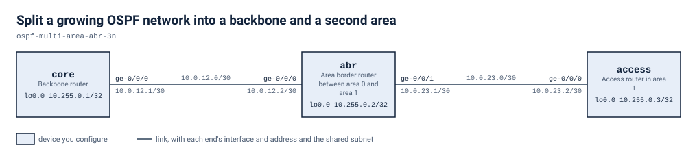

# Split a growing OSPF network into a backbone and a second area

Three routers in a line start with core and abr in OSPF area 0. You bring the access router into area 1 with abr as the area border router, then advertise the access loopback so the backbone learns it as an inter-area route. Reachability is proved in both directions.

## Scenario

You run a small site network built from three routers in a line: core, abr and access. It has been one flat OSPF area, and the link-state database has grown larger than anyone wants to carry. The plan is to keep core in the backbone and move access into its own area. The middle router, abr, becomes the area border router between the two. Nothing may become unreachable while you do it. Right now the abr-to-access link is addressed but carries no OSPF, and access runs no routing protocol at all. You do the change on abr and access, then prove that each end can reach the other's loopback.

## Before you start

Start the lab with `labpack start` from this directory and wait until it says the lab is ready. Each node boots into the start state from its own file under `configs/`, so there is nothing to apply by hand before you begin. `lab.yaml` records how much memory and how many cores the lab needs and where the node images come from; `labpack doctor` checks a machine against it.

If you run the lab with plain containerlab instead and your own image is tagged differently, set `VJUNOS_ROUTER_IMAGE` before you deploy; the topology takes the tag from the environment and falls back to the default it names.

## Working with this lab

<!-- labpack:generated working-with-this-lab -->

This lab comes with a launcher that runs it for you. Every command below is run from this directory, and none of them asks you to type a sign-in.

| To do this | Run this |
| --- | --- |
| Set up the machine the labs run on, once | `labpack setup` |
| Check that machine against what this lab needs | `labpack doctor` |
| See which node images this lab needs | `labpack images` |
| Start the lab and wait until it is ready | `labpack start` |
| Open a session on one of its devices | `labpack connect core` |
| See whether a stage's outcomes have been reached | `labpack check stage1` |
| Ask for the author's hint | `labpack hint stage1` |
| Put every device back to the starting state | `labpack reset` |
| Jump to the start of a stage | `labpack goto stage1` |
| See a stage's answer | `labpack solution stage1` |
| Shut the lab down and prove nothing is left | `labpack down` |

The first time, on a machine that has never run one of these labs, work through `labpack setup`: it asks where the labs should run, sets up the way in, checks the machine against what this lab needs, and walks through any node image that is missing. After that it is remembered and no later command needs to be told again.

The nodes of this lab are `core`, `abr` and `access`. Some of them may be fixtures rather than devices you work on; the drawing below says which.

This lab's stages are `stage1` and `stage2`. Put the one you are working on after `labpack check`, `labpack hint`, `labpack goto` and `labpack solution`.

`labpack goto` and `labpack solution` need the full download. The student download carries no answers, and those two commands say so rather than guess.

You can also run this lab with nothing but the container runtime. `topology.clab.yml` is a plain topology file, every node boots its own starting state from a file under `configs/`, and each file under `checks/` states one outcome as data: which device to ask, what to ask it, and what the answer has to be. So you can read a check and look at the same outcome yourself.

<!-- /labpack:generated working-with-this-lab -->

## Topology

<!-- labpack:generated topology -->

| Node | Its part in this network |
| --- | --- |
| core | Backbone router |
| abr | Area border router between area 0 and area 1 |
| access | Access router in area 1 |

| Node | Interface | Faces | Address |
| --- | --- | --- | --- |
| core | ge-0/0/0 | abr | 10.0.12.1/30 |
| core | lo0.0 | no link | 10.255.0.1/32 |
| abr | ge-0/0/0 | core | 10.0.12.2/30 |
| abr | ge-0/0/1 | access | 10.0.23.1/30 |
| abr | lo0.0 | no link | 10.255.0.2/32 |
| access | ge-0/0/0 | abr | 10.0.23.2/30 |
| access | lo0.0 | no link | 10.255.0.3/32 |

The drawing and the tables above are the whole of the wiring: every node, every link, the interface each link is on at both of its ends, and the address each of them starts with. These are the interface names to use, and nothing in this lab needs any other interface. An interface with no address yet is shown without one.

<!-- /labpack:generated topology -->

## Addressing

| Node | Interface | Address |
| --- | --- | --- |
| core | ge-0/0/0 | 10.0.12.1/30 |
| core | lo0.0 | 10.255.0.1/32 |
| abr | ge-0/0/0 | 10.0.12.2/30 |
| abr | ge-0/0/1 | 10.0.23.1/30 |
| abr | lo0.0 | 10.255.0.2/32 |
| access | ge-0/0/0 | 10.0.23.2/30 |
| access | lo0.0 | 10.255.0.3/32 |

## OSPF design

| Item | Value |
| --- | --- |
| Backbone area | 0.0.0.0 (core-abr link, core and abr loopbacks) |
| Access area | 0.0.0.1 (abr ge-0/0/1, access ge-0/0/0 and access loopback) |
| Link type | point-to-point on all transit links |
| Loopbacks | passive (advertised, no adjacency) |

## What is already built

All three routers are addressed and every loopback is in place. Core and abr already run OSPF in area 0 as point-to-point on their shared link, and their loopbacks are passive in area 0. The core-abr adjacency is up and core and abr can already ping each other's loopbacks. Leave all of this alone. The addressing and the OSPF design tables show the values you should end up with, including the area numbers, the point-to-point link type and the passive loopbacks.

## Stage 1 — Join the access router in area 1

Bring access into the OSPF network as a member of a non-backbone area, area 1. abr must end up with one interface in area 0 and one in area 1, so it borders both, and access must learn the backbone routes across that border. Follow the design: the transit link is point-to-point. Do not touch the existing area 0 configuration on core and abr.

**You're done when**

- access has OSPF routes for the core loopback and for the core-to-abr link, and both are learned via abr's address on the access link.
- access can ping the core loopback with no loss.

Hint: An adjacency only forms when both ends of a link agree on the area. Ask yourself which two interfaces share the abr-access link, and which router each one lives on. Then ask what has to be true of abr for it to count as a border router.

<!-- labpack:generated check-your-work-stage1 -->

**Check your work.** `labpack check stage1`. Stuck? `labpack hint stage1` gives you the author's hint for whichever outcome is not met yet.

<!-- /labpack:generated check-your-work-stage1 -->

## Stage 2 — Advertise the access loopback across the border

Make the access loopback reachable from the backbone, so that core learns it as an inter-area route and the two loopbacks answer each other in both directions. The loopback must be advertised without trying to form an adjacency on it, and it must sit in the same area as the rest of access.

**You're done when**

- abr has an OSPF route for the access loopback, learned from access.
- core has an OSPF route for the access loopback, learned via abr.
- core can ping the access loopback with no loss.

Hint: A router only advertises a loopback that its own OSPF configuration includes. After that, decide which area the prefix belongs to by asking where access lives, not where core lives.

<!-- labpack:generated check-your-work-stage2 -->

**Check your work.** `labpack check stage2`. Stuck? `labpack hint stage2` gives you the author's hint for whichever outcome is not met yet.

<!-- /labpack:generated check-your-work-stage2 -->

## Checking your work

Each outcome of this exercise is written as a check under `checks/`. `checks/baseline.yaml` states what is true before you start and must stay true, and one file per stage states that stage's outcome. Every check names the device and the command it reads, so you can run them with the launcher for this format or read the file and check the outcome by hand.

## Tearing down

Take the lab down with `labpack down`, which proves nothing of it is left running. A lab left up holds the memory and the cores the next one needs.
