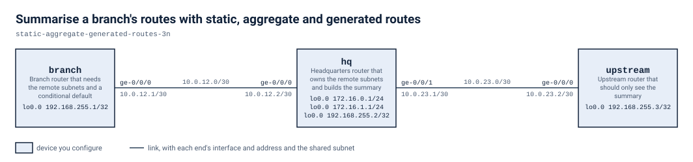

# Summarise a branch's routes with static, aggregate and generated routes

Finish the routing on a three-router line, branch, hq and upstream. Give branch static routes to two subnets that hq owns, build one /23 summary on hq and pass only that to upstream over eBGP, then create a default on branch that exists only while the routes through hq exist. The finished tables show static, aggregate and generated routes.

## Scenario

You've taken over a small three-router network. branch connects to hq, and hq connects to upstream. hq owns two small subnets, 172.16.0.0/24 and 172.16.1.0/24, and branch has to reach them. upstream sits in a different AS and has no business knowing about two separate small prefixes. It should see one summary. branch also needs a default route towards hq, but only while the path to hq is alive. If the routes behind hq go away, the default has to go with them. You have three jobs: give branch the routes it lacks, summarise on hq for upstream, and make the default on branch depend on the routes that justify it.

## Before you start

Start the lab with `labpack start` from this directory and wait until it says the lab is ready. Each node boots into the start state from its own file under `configs/`, so there is nothing to apply by hand before you begin. `lab.yaml` records how much memory and how many cores the lab needs and where the node images come from; `labpack doctor` checks a machine against it.

If you run the lab with plain containerlab instead and your own image is tagged differently, set `VJUNOS_ROUTER_IMAGE` before you deploy; the topology takes the tag from the environment and falls back to the default it names.

## Working with this lab

<!-- labpack:generated working-with-this-lab -->

This lab comes with a launcher that runs it for you. Every command below is run from this directory, and none of them asks you to type a sign-in.

| To do this | Run this |
| --- | --- |
| Set up the machine the labs run on, once | `labpack setup` |
| Check that machine against what this lab needs | `labpack doctor` |
| See which node images this lab needs | `labpack images` |
| Start the lab and wait until it is ready | `labpack start` |
| Open a session on one of its devices | `labpack connect branch` |
| See whether a stage's outcomes have been reached | `labpack check s1` |
| Ask for the author's hint | `labpack hint s1` |
| Put every device back to the starting state | `labpack reset` |
| Jump to the start of a stage | `labpack goto s1` |
| See a stage's answer | `labpack solution s1` |
| Shut the lab down and prove nothing is left | `labpack down` |

The first time, on a machine that has never run one of these labs, work through `labpack setup`: it asks where the labs should run, sets up the way in, checks the machine against what this lab needs, and walks through any node image that is missing. After that it is remembered and no later command needs to be told again.

The nodes of this lab are `branch`, `hq` and `upstream`. Some of them may be fixtures rather than devices you work on; the drawing below says which.

This lab's stages are `s1`, `s2` and `s3`. Put the one you are working on after `labpack check`, `labpack hint`, `labpack goto` and `labpack solution`.

`labpack goto` and `labpack solution` need the full download. The student download carries no answers, and those two commands say so rather than guess.

You can also run this lab with nothing but the container runtime. `topology.clab.yml` is a plain topology file, every node boots its own starting state from a file under `configs/`, and each file under `checks/` states one outcome as data: which device to ask, what to ask it, and what the answer has to be. So you can read a check and look at the same outcome yourself.

<!-- /labpack:generated working-with-this-lab -->

## Topology

<!-- labpack:generated topology -->

| Node | Its part in this network |
| --- | --- |
| branch | Branch router that needs the remote subnets and a conditional default |
| hq | Headquarters router that owns the remote subnets and builds the summary |
| upstream | Upstream router that should only see the summary |

| Node | Interface | Faces | Address |
| --- | --- | --- | --- |
| branch | ge-0/0/0 | hq | 10.0.12.1/30 |
| branch | lo0.0 | no link | 192.168.255.1/32 |
| hq | ge-0/0/0 | branch | 10.0.12.2/30 |
| hq | ge-0/0/1 | upstream | 10.0.23.1/30 |
| hq | lo0.0 | no link | 172.16.0.1/24 |
| hq | lo0.0 | no link | 172.16.1.1/24 |
| hq | lo0.0 | no link | 192.168.255.2/32 |
| upstream | ge-0/0/0 | hq | 10.0.23.2/30 |
| upstream | lo0.0 | no link | 192.168.255.3/32 |

The drawing and the tables above are the whole of the wiring: every node, every link, the interface each link is on at both of its ends, and the address each of them starts with. These are the interface names to use, and nothing in this lab needs any other interface. An interface with no address yet is shown without one.

<!-- /labpack:generated topology -->

## Addressing

| Router | Interface | Address |
| --- | --- | --- |
| branch | ge-0/0/0 | 10.0.12.1/30 |
| hq | ge-0/0/0 | 10.0.12.2/30 |
| hq | ge-0/0/1 | 10.0.23.1/30 |
| upstream | ge-0/0/0 | 10.0.23.2/30 |
| hq | lo0.0 | 192.168.255.2/32, 172.16.0.1/24, 172.16.1.1/24 |

## BGP

| Router | AS | Peer |
| --- | --- | --- |
| hq | 65002 | 10.0.23.2 (AS 65003) |
| upstream | 65003 | 10.0.23.1 (AS 65002) |

## Design values

| Item | Value |
| --- | --- |
| Remote subnets | 172.16.0.0/24 and 172.16.1.0/24 |
| Next hop from branch to the subnets | 10.0.12.2 (hq) |
| Summary prefix built on hq | 172.16.0.0/23 |
| Generated default on branch | 0.0.0.0/0, next hop 10.0.12.2 |

## What is already built

All three routers are addressed and each has only its connected routes. The addressing table gives the link and loopback addresses. hq holds both remote subnets on its loopback. The eBGP session between hq (AS 65002, 10.0.23.1) and upstream (AS 65003, 10.0.23.2) is established and carries no routes yet. upstream currently has neither subnet, branch can reach hq on the shared link, and the interfaces are up. Leave the addressing and the BGP session as they are.

## Stage 1 — Reach the remote subnets

The branch router has no route to the two small subnets that sit behind hq. Give it a fixed route for each, pointing at hq, so it can reach addresses inside them. Only branch needs to change.

**You're done when**

- The branch route table lists 172.16.0.0/24 and 172.16.1.0/24 as static routes with next hop 10.0.12.2.
- The branch router can ping 172.16.0.1 and 172.16.1.1.

Hint: Ask where branch should send the packet, not where the destination is. The next hop has to be an address on the link branch already shares with hq. hq already knows how to answer, so think about what is missing on branch alone.

<!-- labpack:generated check-your-work-s1 -->

**Check your work.** `labpack check s1`. Stuck? `labpack hint s1` gives you the author's hint for whichever outcome is not met yet.

<!-- /labpack:generated check-your-work-s1 -->

## Stage 2 — Summarise for the upstream router

The upstream router should learn one summary covering both subnets and none of the specifics. Build the summary on hq and make sure only that summary is passed to upstream over the existing BGP session. The session must stay as it is.

**You're done when**

- hq holds 172.16.0.0/23 as an aggregate route.
- upstream holds 172.16.0.0/23 learned from BGP with next hop 10.0.23.1.
- upstream still holds neither 172.16.0.0/24 nor 172.16.1.0/24.

Hint: Two questions, and both are on hq. What has to exist before there is something to send? And what does eBGP send by default when it has been told nothing? Whatever policy you build decides what leaves, so decide what it must not let through as well as what it must.

<!-- labpack:generated check-your-work-s2 -->

**Check your work.** `labpack check s2`. Stuck? `labpack hint s2` gives you the author's hint for whichever outcome is not met yet.

<!-- /labpack:generated check-your-work-s2 -->

## Stage 3 — Make a conditional default

The branch router needs a default route that exists only while a route through hq exists. Create it so that it depends on the branch routes towards the remote subnets and points at hq. It must not be a permanent route.

**You're done when**

- The branch route table holds 0.0.0.0/0 with protocol Aggregate and next hop 10.0.12.2.

Hint: A route that is generated takes its next hop from a contributing route, and a policy chooses which routes may contribute. Look at what you built in stage 1 and let the policy accept exactly those routes and nothing else.

<!-- labpack:generated check-your-work-s3 -->

**Check your work.** `labpack check s3`. Stuck? `labpack hint s3` gives you the author's hint for whichever outcome is not met yet.

<!-- /labpack:generated check-your-work-s3 -->

## Checking your work

Each outcome of this exercise is written as a check under `checks/`. `checks/baseline.yaml` states what is true before you start and must stay true, and one file per stage states that stage's outcome. Every check names the device and the command it reads, so you can run them with the launcher for this format or read the file and check the outcome by hand.

## Tearing down

Take the lab down with `labpack down`, which proves nothing of it is left running. A lab left up holds the memory and the cores the next one needs.
